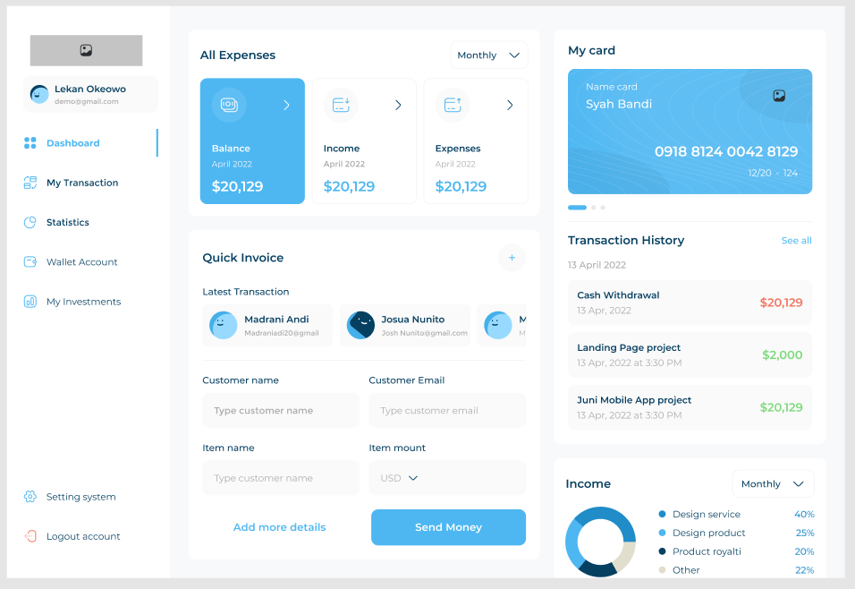

# 💳 Responsive & Adaptive Flutter Finance Dashboard  

## 📌 Overview  
This is a **premium Flutter Finance Dashboard** application designed to be **fully responsive & adaptive** across **Desktop, Mobile, Web, and Tablet** platforms.  
Built with **Flutter & Dart**, the UI is sleek, modern, and optimized for **scalability, performance, and user experience**.  

Perfect for finance, banking, or payment-related applications, this dashboard comes with ready-made components, smooth animations, and a clean architecture — making it an ideal starting point for your next project.  

---

## ✨ Key Features  
- 🖥 **Cross-Platform Support** – Works perfectly on Desktop, Mobile, Web, and Tablet.  
- 📱 **Responsive & Adaptive Layout** – Scales beautifully on all screen sizes using `LayoutBuilder` & `MediaQuery`.  
- 🎨 **Modern UI Design** – Minimal, elegant, and finance-themed.  
- 📊 **Dashboard Widgets** –  
  - **Expenses Overview** – Balance, Income, and Expenses cards.  
  - **Digital Card Display** – Masked card numbers with clean design.  
  - **Transaction History** – Detailed, color-coded list of financial activities.  
  - **Quick Invoice** – Send money and create invoices instantly.  
  - **Income Statistics** – Pie chart breakdown by category.  
- ⚡ **High Performance** – Optimized build methods and widget rendering.  
- 🌙 **Theme Ready** – Easy to add Dark Mode.  
- 🛠 **Clean Code Architecture** – Easy to maintain and extend.  

---

## 🖼 Preview  

  

---

## 🛠 Tech Stack  
- **Flutter** – Cross-platform UI framework.  
- **Dart** – Core programming language.  
- **Responsive Layouts** – `LayoutBuilder`, `MediaQuery`, custom adaptive widgets.  
- **Chart & Data Visualization** – Easily customizable chart widgets.  
- **Cross-Platform Deployment** – Android, iOS, Web, Windows, macOS, Linux.  

---

## ⚙️ Customization  
You can easily customize:  
- **Colors & Themes** – Change `ThemeData` to match your brand.  
- **Widgets & Layouts** – Modify UI components to add new sections.  
- **Data Sources** – Integrate with real APIs (REST, GraphQL, Firebase, Supabase).  
- **Animations** – Add Lottie animations or Flutter `AnimatedContainer` effects.  

---

## 🚀 Getting Started  

### 1️⃣ Installation  
```bash
# Clone the repository
git clone https://github.com/yourusername/flutter-finance-dashboard.git

# Navigate to project folder
cd flutter-finance-dashboard

# Get dependencies
flutter pub get
````

### 2️⃣ Run the Project

```bash
flutter run
```

## 🤝 Contribution

Contributions are welcome! If you’d like to:

* Add new features
* Fix bugs
* Improve UI/UX
* Enhance performance

Just fork the repo, create your branch, and submit a pull request.